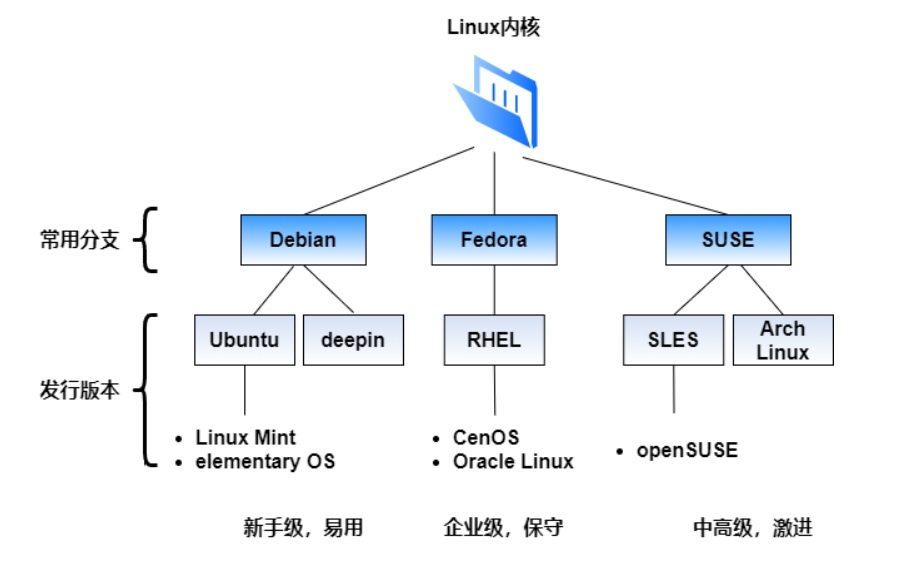
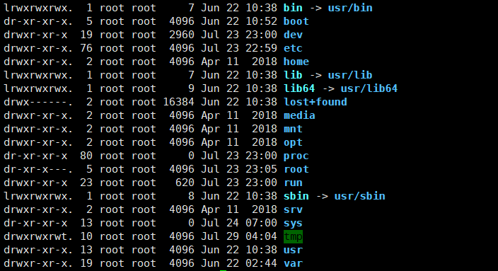
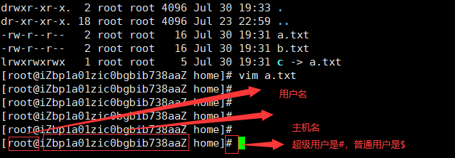
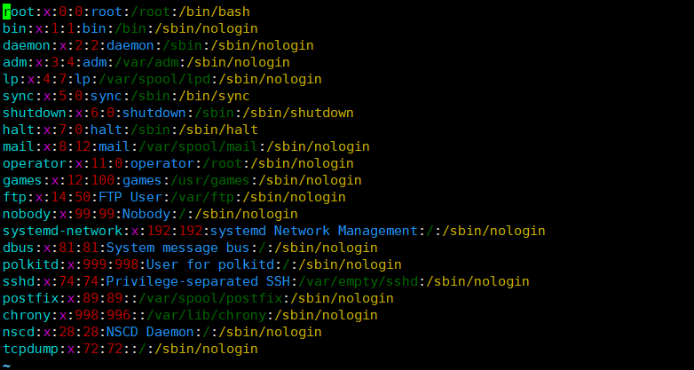

# Linux学习笔记

### 1. 入门概述

##### 1.1 Linux简介

Linux是一套免费使用和自由传播的类Unix操作系统，是一个基于POSIX(可移植操作系统接口)和Unix的多用户、多任务、支持多线程和多CPU的操作系统

Linux能够运行主要的Unix的工具软件、应用程序和网络协议。它支持32位和64位硬件，Linux继承了Unix以网络为核心的设计思想，是一个性能稳定的多用户网络操作系统

##### 1.2 Linux发行版本

- linux内核（kernel）

  kernel的中文是“操作系统核心”（简称内核），主要用于管理硬件和提供相关的能力实现，例如存取硬盘、网络功能、CPU资源获取等。

  内核版本由linux的开发团队开发，可以在 [www.kernel.org](http://www.kernel.org/) 找到历史版本。

- Linux发行版

  一个完整的 Linux发行版包括了内核与一些其他与文件相关的操作，用户管理系统，和软件包管理器等一系列软件。每个工具都是整个系统的一小部分。这些工具通常都是一个个独立的项目，有相应的开发者来开发及维护。

  **Linux发行版，是由不同的厂家打包Linux内核与应用软件，基于内核进行上层系统的构建。**

  

常见发行版本有：

- 易用，适合于新手

  [Debian](https://www.debian.org/)：最大的Linux发行版，非常稳定，卓越的质量控制，**.deb**软件包管理值得推荐。

  隶属于Debian分支的有：

  - [Ubuntu](https://cn.ubuntu.com/)：易用、对新手友好，最受欢迎的桌面Linux发行版
  - [deepin](https://www.deepin.org/)：国产的发行版
  - [Linux Mint](https://linuxmint.com/)：基于Ubuntu的再发行版，更易用，为用户提供卓越的“桌面系统”使用体验
  - [elementary OS](https://elementary.io/)：基于Ubuntu的再发行版

  [PCLinuxOS](https://www.pclinuxos.com/)：是一个面向KDE的发行版，具有定制且始终最新版本的流行桌面环境。

- 激进，适合于中高级用户

  [Slackware](http://www.slackware.com/)：SUSE Linux Enterprise， 简称SUSE，大蜥蜴，一个高度技术性、干净的发行版

  [Arch Linux](https://www.archlinux.org/)：面向高级Linux用户，“滚动更新机制”，只需要安装一次，然后保持一直更新，不要从头安装新的系统。这都要感谢其强大的包管理器和一个总是最新的软件库。隶属于Arch分支的有：[Manjaro Linux](https://manjaro.org/)，针对安装更加友好。

- 保守，适合于企业用户

  [Red Hat](https://www.redhat.com/en)：Red Hat Enterprise Linux 简称RHEL，大名鼎鼎的红帽。

  隶属于红帽系列的有：

  - [CentOS](https://www.centos.org/)：详细介绍参阅[维基百科](https://zh.wikipedia.org/wiki/CentOS)，一个可靠的服务器发行版，稳定性、可靠性和软件长期支持
  - [Fedora](https://getfedora.org/)：详细介绍参阅[维基百科](https://zh.wikipedia.org/wiki/Fedora)，

  [FreeBSD](https://www.freebsd.org/)：快速，高性能和非常稳定的操作系统，尤其适用于Web服务和类似的任务。

  [openSUSE](https://www.opensuse.org/)：非常稳定的编程操作系统。主要优势：YaST包管理，可以轻松实现不同的任务自动化；软件交付方法。

各大Linux发行版的排名及详细情况参考该网站：https://distrowatch.com/。

### 2. 走近Linux系统

##### 2.1 开机

开机会启动很多程序，他们在windows下叫"服务"(service)，在linux下叫守护进程(daemon)

##### 2.2 关机

linux一般都是作为服务器，所以很少遇到关机的情况

在需要关机的时候，**首先需要运行`sync`命令，这个命令是将数据由内存同步到硬盘中**

常用的关机命令有

```bash
shutdown #关机指令

shutdown -h 10 #十分钟后关机

shutdown -h now #立刻关机

halt #等同于shutdown -h now 或者poweroff

shutdown -h 20:25 #系统将在20：25关机

shutdown -r now #立刻重启

reboot #等同于 shutdown -r now

```

##### 2.3 目录结构

**各目录的解释**

- `/bin`：这个目录存放着最经常使用的命令
- `/boot`：这里存放着启动linux时使用的一些核心文件，包括一些连接文件和镜像文件
- `/dev`：dev时device(设备)的缩写，存放linux的外部设备，在linux中访问设备的方式和访问文件的方式一样
- **`/etc`：这个目录用来存放所有的系统管理所需要的配置文件和子目录，比如redis配置等**
- **`/home`：用户的主目录，该目录下的目录一般都是以用户的账号命名**
- `/lib`：这个目录存放着系统最基本的动态连接共享库，其作用类似有windows中的dll文件
- `/lost+found`：这个目录一般为空的，当系统非法关机的时候，这里存放了一些文件
- `/media`：linux会自动识别一些设备，例如U盘，光驱等，当识别后，会把设备挂载到这个目录下
- `/mnt`：系统提供该目录是为了让用户临时挂载别的文件系统的，我们可以把光驱挂载到/mnt上
- **`/opt`：这是主机额外安装软件所摆放的目录，比如你安装一个oracle数据库就放在这个目录下，默认是空的**
- `/proc`：这个目录是一个虚拟目录，它是系统内存的映射，我们可以通过直接访问这个目录来获取系统信息
- **`/root`：这个是系统管理员目录**
- `/sbin`：s的意思是super user，这里存放的是系统管理员使用的系统管理程序
- `/srv`：该目录存放一些服务启动后需要提取的数据
- `/sys`：这时linux2.6内核的一个很大的变化，该目录下安装了2.6内核中新出现的一个文件系统sysfs
- **`/tmp`：存放临时文件的目录**
- **`/usr`：这是一个很重要的目录，用户的很多应用程序和文件都放在这个目录下，类似于windows下的program file目录**
- `/usr/bin`：系统用户使用的应用程序
- `/usr/sbin`：超级用户使用的比较高级的管理程序和系统守护进程
- `/usr/src`：内核源代码默认的放置目录
- **`/var`：这个目录存放着不断扩充的东西，比如各种日志文件，一般都存放在这个目录下**
- `/run`：是一个临时文件系统，存储系统启动以来的信息，当系统重启之后，这个目录下的文件应该被删除
- `/www`：（需要自己创建，默认是没有的）存放服务器网站相关的资源，环境，网站的项目等

### 3. 常用的基本命令

##### 3.1 目录管理

- `ls`命令：

  ```bash
  ls
  	-a:查看所有的文件
  	-l:查看文件信息，包含文件的属性和权限
  ```

- `cd`命令

- `pwd`：显示当前所在目录

- `mkdir`：创建一个目录

  ```bash
  mkdir
  	-p:递归创建目录
  ```

- `rmdir`：删除目录，**该命令只能删除空目录**

  ```bash
  rmdir
  	-p:递归删除目录，如：rmdir -p /a/b/c
  ```

- `cp`：复制文件或者目录

  ```bash
  cp 被复制的文件，复制到什么路径什么名称
  例如：cp a.txt /a/b/c/b.txt
  ```

- `rm`：删除文件或者目录

  ```bash
  rm
  	-f：不出现警告，强制删除
  	-r: 递归删除目录
  	-i: 互动 删除询问是否删除
  # 千万不要执行 rm -rf / 这是删除所有！！！！！！！！！！！！！！！！！！
  ```

- `mv`：移动文件，**可以用来重命名**

  ```bash
  mv
  	-f：强制
  	-u: 只替换已经更新过的文件
  ```

##### 3.2 文件和目录的属性相关



在linux中，第一个字母代表这个是文件、目录或者连接文件等

- d：表示目录
- -：表示文件
- l：表示链接文件

接下来是**三个字母一组**，各字母含义：

- r：可读，其对应的数字是1
- w：可写，其对应的数字是2
- x：可执行，其对应的数字是4
- -：表示没有权限，其对应的数字是0

这些字母的位置是固定的，如果没有对应的权限就是`-`，如：`r-x`，

**一共有三组，从左到右依次为：**

1. **文件所属用户权限**
2. **文件所属组权限**
3. **其他用户权限**

>常用命令

- `chgrp`：更改文件所属组

  ```bash
  chgrp [-R] 所属组 文件或目录名
  	-R：递归修改文件所属组,如 chgrp -R root /www
  ```

- `chown`：更改文件所属用户

  ```bash
  chown [-R] 所属用户 文件或目录名
  	-R：递归修改文件所属用户,如 chown -R root /www
  ```

- `chmod`：修改文件权限（必须掌握）

  ```bash
  chmod [-R] 文件权限 文件或目录名
  	-R：递归修改文件所属用户,如 chmod 755 a.txt
  ```

##### 3.3 文件内容查看(重要)

- `cat`：从第一行开始显示内容

- `tac`：从最后一行开始显示

- `nl`：显示的时候，输出行号

- `more`：一页一页的显示文件内容 （空格翻页，enter翻一行）

- `less`：同`more`类似，但是less可以先前翻页（**空格翻页，方向上下键上下翻行，在打开文本中，使用`/xxx`向下查找字符串,用`n`显示下一个查找到的，`N`显示上一个，使用`?xxx`向上查找，用`n`显示下一个,`N`显示上一个**）

- `head`：只看头几行

- `tail`：只看尾部几行 常用的

  ```bash
  tail
  	-f 实时刷新
  	-n 显示尾部几行
  #常用
  tail -f -n 10 a.txt
  ```

##### 3.4 其他命令

- `ifconfig`：查看网络设置
- `touch`：创建文件
- `echo`：输入字符串，也可以输入到文件中：`echo 'hello world!' >> a.txt`
- `hostname 主机名`：修改主机名,修改之后需要重新连接一下

##### 3.5 硬链接和软链接（了解）

> Linux中链接的概念

链接分为两种：硬链接和软链接

- 硬链接：A----->B，如果B是A的硬链接，那么他们两个指向同一个文件，允许一个文件拥有多个路径，即便删了A，也可以用B访问到文件，A文件修改了，B文件也会跟着修改
- 软链接：类似于windows下的快捷方式，删除了源文件，快捷方式也访问不了了

创建链接 用`ln`命令

```bash
#创建一个硬链接
[root@iZbp1a01zic0bgbib738aaZ home]# ln a.txt b.txt
[root@iZbp1a01zic0bgbib738aaZ home]# ls
a.txt  b.txt
#修改a文件，b文件也会被修改
[root@iZbp1a01zic0bgbib738aaZ home]# vim a.txt 
[root@iZbp1a01zic0bgbib738aaZ home]# vim b.txt 
#ln -s 创建一个软链接
[root@iZbp1a01zic0bgbib738aaZ home]# ln -s a.txt c
[root@iZbp1a01zic0bgbib738aaZ home]# ls
a.txt  b.txt  c

```

##### 3.6 Vim编辑器（重要）

vim有三种模式：

- **命令模式**：用户用vim打开文件就进入了命令模式，在命令模式下不能进行输入，在命令模式下切换到其他模式:
  - 按下`i`：进入输入模式，按下`o`表示从光标下一行开始输入
  - 按下`x`：删除当前光标所在字符
  - 按下`:`：进入底线命令模式
  
  命令模式下常用的命令
  
  ```bash
  dd:删除光标所在行
  ndd:光标开始删除n行,比如10dd，删除10行
  dG:删除光标所在行到最后一行数据
  d$:删除光标所在位置到该行最后一个位置
  yy:复制当前一行数据，然后按p 表示粘贴复制的信息
  nyy:复制n行,然后按p 表示粘贴复制的信息
  n <space>: 从光标开始向后移动多少行
  [Ctrl]+f:向下翻页，同[Page Down]
  [Ctrl]+b:向上翻页，同[Page Up]
  :set nu : 显示行号
  :wq ：保存并退出
  HOME/END：移动光标到行首/行尾，同0和$
  gg:移动到文档第一行
  G:移动到文件最后一行
  : n :表示跳到哪一行  例如 :20 跳到20行
  /xxx:向下搜索某一个字符，n表示下一个匹配的，N表示上一个匹配的
  ?xxx:向上搜索某一个字符，n表示下一个匹配的，N表示上一个匹配的
  ```
  
  
  
- **输入模式**：在输入模式中，退出输入模式需要按`Esc`键，就会进入命令模式，在输入模式中常用的命令

  ```bash
  HOME/END：移动光标到行首/行尾
  Page Up/Page Down：上下翻页
  ```

  

- **底线命令模式**：在命令模式下按`:`进入底线命令模式，输入`wq`保存文件并退出

##### 3.7 用户管理

用户管理的本质是就是在`/etc/passwd`文件中添加、修改或删除用户信息

- `useradd`：添加用户(root权限才能添加)，添加，创建用户的时候记着设置密码

  ```bash
  useradd [- 选项] 用户名
  	-m: 自动创建用户主目录 /home/用户名
  	-d：指定用户主目录
  	-c：添加用户描述
  	-g: 指定用户所在组
  ```

- `userdel`：删除用户，常用的参数有`-r`:删除用户的目录 

- `usermod`：修改用户信息，常用的选项同`useradd`

- `su 用户名`：切换用户，切换root用户使用`sudo su`，切换用户后再切回来输入`exit`

  

- `passwd 用户名`：设置用户密码，root用户可以设置所有用户的密码，普通用户只能修改自己密码

- `passwd -l 用户名`：锁定账户，该用户不能登录，或者`passwd -d 用户名`是删除用户密码，第二次也不能登录

> `/ect/passwd`文件理解

`用户名:口令(登陆密码，不可见):用户标识:组标识:注释性描述:主目录:登录shell`

每一行代表一个用户，真实的密码在`/etc/shadow`中，不过是加密的



##### 3.8 用户组管理

用户组管理的本质是对`/etc/group`文件的添加、修改或删除

- `groupadd`：添加用户组，添加用户的时候可以指定用户组id `-g 111` ，如果不指定默认时自增的
- `groupdel`：删除用户组
- `groupmod`：修改用户组，常用的选项有`-g`，`-n`修改组名称

##### 3.9 磁盘管理

- `df`：列出所有磁盘使用情况，常用的选项是`-h`：更直观使用情况

  ```bash
  [root@iZbp1a01zic0bgbib738aaZ home]# df -h
  Filesystem      Size  Used Avail Use% Mounted on
  devtmpfs        909M     0  909M   0% /dev
  tmpfs           919M     0  919M   0% /dev/shm
  tmpfs           919M  492K  919M   1% /run
  tmpfs           919M     0  919M   0% /sys/fs/cgroup
  /dev/vda1        40G  2.0G   36G   6% /
  tmpfs           184M     0  184M   0% /run/user/0
  ```

- `du`：查看当前目录磁盘占用情况，常用的选项是`-ah`：显示该目录下所有文件的磁盘占用情况，

- `mount`：挂载目录

  ```bash
  #把外部设备abc 挂载到/mnt/abc下
  mount /dev/abc /mnt/abc
  ```

- `unmount`：卸载目录，常用的选项`-f`强制卸载